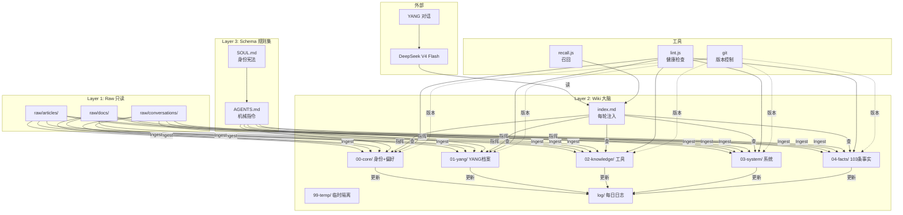
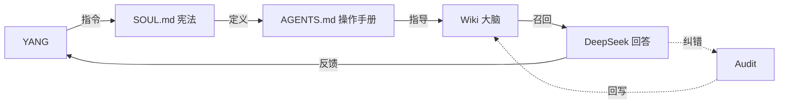

# Hermes Brain — 第二大脑架构说明

> 路径：`D:\ai_schedule\hermes-brain\`
> 宪法：`C:\Users\YANG\AppData\Local\hermes\SOUL.md`
> 操作手册：`AGENTS.md`（同目录，必须照做）
> 备份：`D:\ai_schedule\backup\`
> 版本：v3.1 (2026-06-26 重建 + 彻底熔断旧管道)

---

## 一句话定位

**这是一个由 LLM 持续维护、互相链接、不断编译的 Markdown Wiki，是龙虾唯一的记忆后端。**

不是 Notion 的 AI 插件，不是向量数据库的另一种包装。是一种**复利式**的知识积累范式——你往里投一份资料、提一个好问题，整个知识库都会变得稍微更聪明一点。

---

## 架构图



---

## 三层架构（karpathy 范式）

```
Layer 1: raw/        只读原始资料，你放进去，AI 只读不改
Layer 2: wiki/       AI 维护的页面（摘要/实体/概念/对比），互相 [[wiki-link]]
Layer 3: schema/     AGENTS.md，告诉 AI 怎么干活（机械指令，不要哲学）
```

每一层职责严格分离。raw 是只读真相源，wiki 是 LLM 的产物，AGENTS.md 是规则集。

---

## 五大核心操作（机械指令详见 AGENTS.md）

```mermaid
flowchart LR
    O[操作触发] --> I{操作类型}
    I -->|新资料| A1[Ingest<br/>写页面+更新INDEX+append log]
    I -->|提问| A2[Query<br/>读wiki+回答+回填]
    I -->|cron周日| A3[Lint<br/>检查矛盾/孤立/过期]
    I -->|YANG纠错| A4[Audit<br/>记99-temp/audit]
    I -->|trust<0.3+>14天| A5[Forget<br/>归档非删除]
    A1 --> W[wiki]
    A2 --> W
    A3 --> L[lint-{date}.md]
    A4 --> AT[audit-{date}.md]
    A5 --> AR[archived-{date}.md]
```

| 操作 | 触发 | 写入 | 何时用 |
|------|------|------|--------|
| **Ingest** | 新资料放进 raw/ | wiki 新建/更新，更新 index，append log | 你丢了一份新资料 |
| **Query** | 你提问 | 读 wiki + 回答（必要时把好答案写回 wiki） | 你问任何问题 |
| **Lint** | 每周日 22:00 cron 自动跑 | `wiki/99-temp/lint-{date}.md` | 周末体检 |
| **Audit** | 你读 wiki 时发现错误 | `wiki/99-temp/audit-{date}.md` | 你看到错的页面 |
| **Forget** | Lint 发现过期（>14天未用 + trust<0.3） | `wiki/99-temp/archived-{date}.md` | 自动维护 |

---

## 数据流（取代旧三管道）

```
旧:  memory（注入 prompt） ←→ fact_store（向量） ←→ second-brain（手动）
新:  Wiki INDEX（注入 prompt ≤800字） → 召回具体页面 → 写回页面
```

**单一来源**：Wiki 是唯一真相。memory 缩成一个 INDEX 指针（指向 wiki 分类），fact_store 实体化到 `wiki/04-facts/`。

---

## 与 SOUL.md 的关系

```
SOUL.md  ──定义身份边界──>  AGENTS.md
AGENTS.md ──定义操作流程──>  Wiki
Wiki      ──存放具体内容──>  SOUL.md
```

- **SOUL.md 是宪法**：身份、管家担当、绝不代发、预算敏感等不可变规则
- **AGENTS.md 是操作手册**：怎么读写 wiki 的具体流程（机械指令，DeepSeek 友好）
- **wiki 是大脑**：所有事实/偏好/路径/规则的可维护知识
- 三者铁三角：宪法定义边界，操作手册定义流程，wiki 装具体内容

**修改优先级**：SOUL.md > AGENTS.md > wiki 任何页面
**写入优先级**：你手动说 > 宪法级自动 > 日常对话

---

## 与 SOUL.md 的关系（详细）



---

## 13 项 llm-wiki-skill 优化（已实现情况）

| # | 优化项 | 状态 | 实现位置 |
|---|--------|------|----------|
| 1 | 多路径原始资料库 | ✅ | `raw/{articles,docs,conversations}/` |
| 2 | 优化 INDEX 结构 | ✅ | `index.md` 按类别 |
| 3 | 每日日志文件 | ✅ | `log/{YYYY-MM-DD}.md` |
| 4 | 按类别拆分 wiki 文件 | ✅ | `wiki/{00..04,99}-*/` |
| 5 | 大文件不直接复制 | ✅ | AGENTS.md 第 6.3 节明令 |
| 6 | Mermaid 流程图 | ✅ | 本文件架构图 |
| 7 | Audit 反馈闭环 | ✅ | AGENTS.md 第 4 章 |
| 8 | 5 个核心操作 | ✅ | Ingest/Query/Lint/Audit/Forget |
| 9 | at 反馈插件 | ⚠️ | Claude Code 专属，Hermes 用 `Audit` 命令替代 |
| 10 | 前端可视化 | ❌ | 未做，Obsidian 自身有 Graph View 替代 |
| 11 | 插件集成 | ✅ | `plugins/` 目录已存在 |
| 12 | 完整 skill | ✅ | AGENTS.md 9.7KB |
| 13 | qmd 搜索 | ✅ | recall.js 简易版 + 可升级 qmd |

---

## 回滚（任何时候）

```powershell
# 完全回滚到 Wiki 重建前
Copy-Item "D:\ai_schedule\backup\hermes-pre-wiki-rebuild-20260626-124508\live-hermes\*" "C:\Users\YANG\AppData\Local\hermes\" -Recurse -Force
```

熔断后的回滚：
```powershell
# 恢复 config.yaml 和 memory_store.db
Copy-Item "D:\ai_schedule\backup\hermes-pre-meltdown-*\live-hermes\*" "C:\Users\YANG\AppData\Local\hermes\" -Recurse -Force
```

3 天灰度期内如果命中率 < 80%，自动回滚。